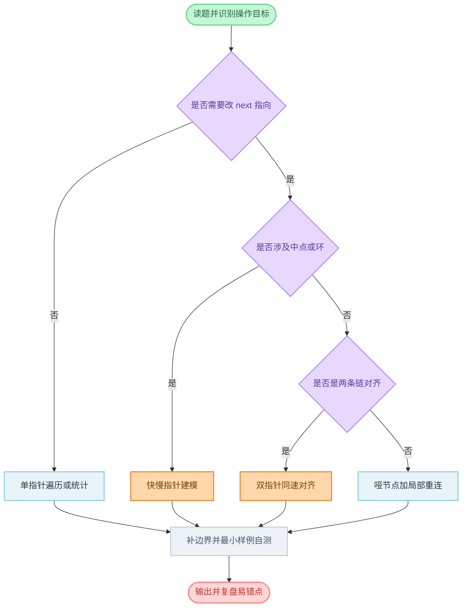

# 链表常见题型与解法总结

这篇文档按「识别信号 → 套路模板 → 易错点」总结链表高频题，目标是：看到题就能快速归类，先选对方法，再写对边界。

速查版：[`docs/0000-linked-list-quick-reference.md`](../docs/0000-linked-list-quick-reference.md)

## 先建立一套统一认知

- 链表题本质是在操作指针关系，核心不是值计算，而是 `next` 的重连。
- 写题前先想清楚三件事：当前指针是谁、下一步要改哪条边、循环退出时指针应该停在哪。
- 能用哑节点 `dummy` 就尽量用，尤其是删除头节点、局部翻转这类题，能显著减少分支。
- 面试里优先用可口述的模板：慢一点没关系，先保证不炸边界。

## 常见题型一览

### 1) 遍历统计类

代表题：`206` 的子过程、链表长度、找倒数第 `k` 个前的预处理。

识别信号：

- 只需要顺着 `next` 看每个节点一次。
- 不涉及节点重连，只读或简单计数。

模板：

```go
cur := head
for cur != nil {
    // 使用 cur
    cur = cur.Next
}
```

易错点：

- 循环条件应是 `cur != nil`，因为你要处理最后一个节点。
- 若循环体里要读 `cur.Next`，要先确认 `cur` 非空。

### 2) 反转类

代表题：`206 反转链表`、`92 反转链表 II`、`25 K 个一组翻转链表`。

识别信号：

- 关键词常见「反转」「逆序」「从尾到头」。
- 需要修改链表方向，通常至少有一段 `next` 会重连。

核心模板（三指针）：

```go
var prev *ListNode
cur := head
for cur != nil {
    nxt := cur.Next
    cur.Next = prev
    prev = cur
    cur = nxt
}
// prev 为新头
```

易错点：

- `nxt` 要先保存，再改 `cur.Next`。
- 局部反转时要记得把反转段前后重新接回去。

### 3) 快慢指针类

代表题：`876 链表的中间结点`、`141/142 环形链表`、`234 回文链表`。

识别信号：

- 需要中点、判环、环入口、前半后半对称比较。

模板思路：

- `slow` 每次走一步，`fast` 每次走两步。
- `fast` 到尾时，`slow` 在中点附近。

易错点：

- 常见循环条件是 `fast != nil && fast.Next != nil`。
- 如果你要用 `fast.Next.Next`，条件要写成 `fast.Next != nil && fast.Next.Next != nil`。
- 不同条件对应 `slow` 停位不同，后续逻辑要配套。

### 4) 双指针同速对齐类

代表题：`160 相交链表`、`19 删除链表的倒数第 N 个结点`。

识别信号：

- 两条链要找同一位置，或同一链里找相对距离固定的节点。
- 本质是「步数对齐」。

常见做法：

- `160`：A 走到空接 B，B 走到空接 A，对齐长度差。
- `19`：先让快指针领先 `n` 步，再同步走，快到尾时慢在目标前驱。

易错点：

- `160` 判断切换时是 `cur == nil`，不是 `cur.Next == nil`。
- `19` 删除时通常用 `dummy`，避免删除头节点时特殊处理。

### 5) 合并类

代表题：`21 合并两个有序链表`、`23 合并 K 个升序链表`。

识别信号：

- 多条有序链要合并成一条有序链。

模板思路：

- 准备 `dummy` 和 `tail`。
- 每次从候选头里选最小节点接到 `tail` 后，推进对应指针。
- 最后把剩余链整体挂上。

易错点：

- `tail = tail.Next` 不要漏。
- 最后剩余链只需一次挂接，不要重复遍历。

### 6) 删除与分割类

代表题：`203 移除链表元素`、`86 分隔链表`、`82 删除排序链表中的重复元素 II`。

识别信号：

- 关键词常见「删除满足条件节点」「按阈值分组后拼接」。

模板思路：

- 绝大多数场景先加 `dummy`。
- 用 `prev` + `cur` 维护「已处理尾」和「待判断节点」。

易错点：

- 删除连续区间时，`prev` 何时前进要分清楚。
- 分割题最后要手动断尾，防止形成隐式环。

### 7) 复制与随机指针类

代表题：`138 随机链表的复制`。

识别信号：

- 节点除了 `Next` 还有额外指针（如 `Random`）。

常见解法：

- 哈希映射：旧节点到新节点，逻辑直观。
- 原地穿插：旧新交错、回填随机、再拆分，空间更优。

易错点：

- 空指针字段要单独判断。
- 拆分阶段要恢复原链结构。

## 一套通用写题流程

1. 先画 3 到 5 个节点的小图，标出你要维护的指针角色。  
2. 明确循环不变量：每轮结束后，哪一段一定是正确的。  
3. 先写主循环，再补边界：空链、单节点、删除头、尾部连接。  
4. 用最小反例自测：`[]`、`[1]`、`[1,2]`、`[1,2,3]`。  
5. 如果修改了结构，最后确认是否需要恢复原链。  

## 高频易错清单

- 先改 `cur.Next` 再访问旧 `cur.Next`，导致断链。
- 删除节点后错误地同时移动了 `prev`，跳过待检查节点。
- 局部反转后忘记接回前后两端。
- 快慢指针循环条件和后续取值不匹配，触发空指针。
- 终态判断写成 `cur.Next != nil`，但循环体里其实需要处理尾节点。

## 推荐刷题路径

- 基础指针感：`206` → `21` → `203`
- 快慢指针：`876` → `141` → `142`
- 进阶结构改造：`19` → `92` → `234` → `160` → `25`
- 拓展模型：`138`、`23`

---

## 流程图解


