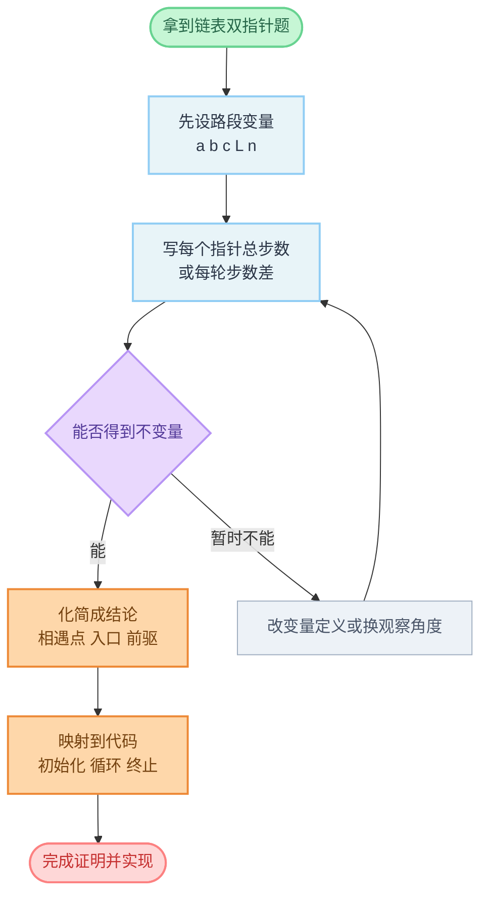

# 链表中的数学推断专题（步数关系与不变量）

这篇专题聚焦一类“看起来是指针题，实质靠步数关系推导”的链表题。目标不是背结论，而是记住可复用的推断框架：**设变量、列步数、找不变量、回到代码**。

## 为什么链表题会用到数学推断

- 链表缺少随机访问，很多题无法直接“按下标对齐”。
- 双指针题常用“每轮前进步数差”替代数组里的下标差。
- 只要能把过程写成等式，很多“玄学结论”都能落地成必然结论。

## 一套通用推导模板

1. **定义路段变量**：如 `a`（头到目标）、`b`（目标到相遇）、`L`（环长）等。  
2. **写出指针总步数**：慢指针每轮 `+1`、快指针每轮 `+2`，或两指针是否同速。  
3. **利用结构约束**：例如“步数差是环长整数倍”“两人走过总长度相同”。  
4. **化简成可执行结论**：比如“把一个指针放回头，二者同速走会在入口相遇”。  
5. **映射到代码动作**：确认初始化、循环条件、终止条件与推导一一对应。

## 高频题型与核心推断

## 1) 141. 环形链表：为什么有环一定会相遇

结论：快慢指针在环内必相遇。  

推断要点：

- 进入环后，快指针每轮比慢指针多走 1 步。
- 二者在环上的相对距离每轮变化 1（模 `L`）。
- 在有限状态空间 `0...L-1` 中，差值必回到 `0`，因此会相遇。

代码含义：`for fast != nil && fast.Next != nil` 内若 `slow == fast`，即可判有环。

## 2) 142. 环形链表 II：为什么第二次相遇是入口

设：

- `a`：头到入口
- `b`：入口到首次相遇
- `L`：环长

首次相遇时：

- 慢走 `a+b`
- 快走 `2(a+b)`
- 差值为环长整数倍：`2(a+b) - (a+b) = kL`
- 得到 `a+b = kL`，即 `a = kL - b`

含义：从首次相遇点再走 `a` 步会到入口；从头走 `a` 步也到入口。  
所以一个指针回头，另一个留在相遇点，同速前进会在入口相遇。

## 3) 160. 相交链表：为什么换头后会在交点相遇

设：

- `a`：A 独有段长度
- `b`：B 独有段长度
- `c`：公共尾长度

两指针路线分别是：

- 指针 1：`A + B`，到交点前步数 `(a+c)+b = a+b+c`
- 指针 2：`B + A`，到交点前步数 `(b+c)+a = a+b+c`

二者在到交点前步数相同，故会在交点对齐；若无交点，最终同到 `nil`。

## 4) 19. 删除链表倒数第 N 个结点：为什么“先让 fast 领先 n 步”有效

结论：当 `fast` 到尾时，`slow` 正好在待删结点前驱。  

推断要点：

- 让 `fast` 先走 `n` 步，之后 `slow`、`fast` 同速走。
- 全程保持不变量：`dist(fast, slow) = n`。
- 当 `fast` 到达尾后（或 `nil`，看实现），`slow` 相对目标仍保留固定偏移，故可一跳删除。

## 5) 61. 旋转链表：为什么先取模 `k % n`

结论：旋转 `k` 次与旋转 `k % n` 次等价。  

推断要点：

- 长度为 `n` 的链表每旋转 `n` 次回到原形。
- 先算 `k %= n` 可去掉整圈无效操作。
- 再把“找新头”转成“找新尾”位置：新尾在第 `n-k` 个结点（1-index 视实现）。

## 易混点：不是“有公式就叫数学题”

- `206` 反转链表更偏指针重连，不依赖步数等式。
- `21` 合并有序链表更偏双路归并，不靠严格的距离推导。
- 一个实用判断：**如果核心正确性依赖“步数关系/同余/不变量”，就是本专题类型。**

## 推荐专题刷题顺序

1. `141`（判环）  
2. `142`（环入口）  
3. `160`（路径对齐）  
4. `19`（固定间距不变量）  
5. `61`（取模 + 位置映射）

可迁移练习（非链表但同思想）：`287 寻找重复数`（把数组下标视为指针跳转图，使用 Floyd 思想）。

## 面试口述模板（30 秒）

“这题不是硬模拟，我先设路段变量，把双指针总步数写成等式。  
再用结构约束（比如环长整数倍、领先固定距离、两条路径总长相同）得到不变量。  
最后把不变量映射回代码的初始化、循环条件和相遇/退出条件，证明正确性与边界都一致。”

---

## 流程图解

