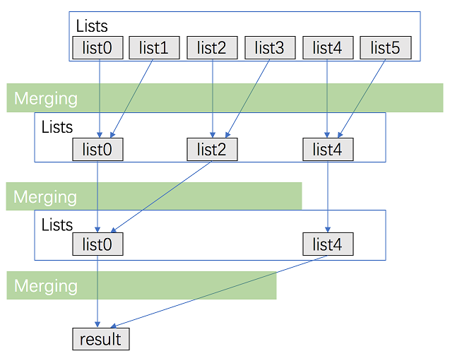
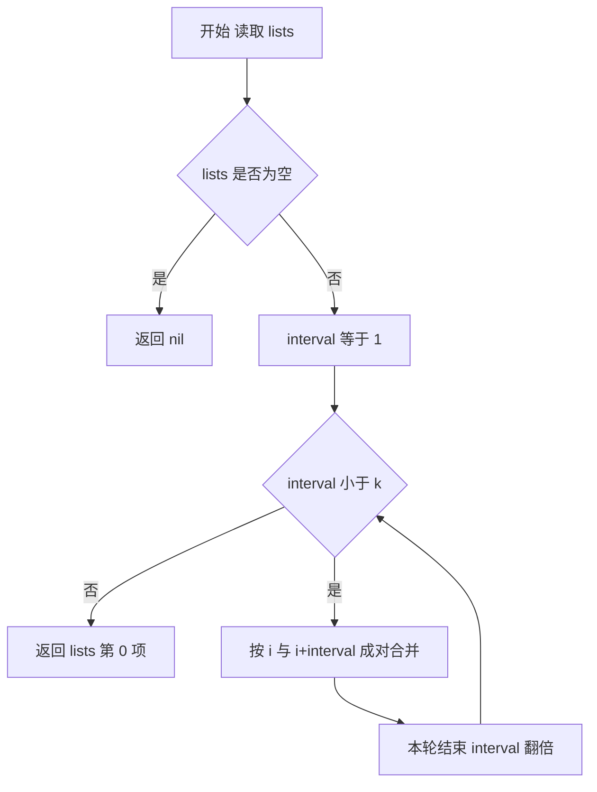

# 23. 合并 K 个升序链表

**代码**：[codes/0023-merge-k-sorted-lists.go](../codes/0023-merge-k-sorted-lists.go)

题库入口：[23. 合并 K 个升序链表](https://leetcode.cn/problems/merge-k-sorted-lists/?envType=study-plan-v2&envId=top-100-liked)

## 题目

给你一个链表数组 `lists`，每个链表都已经按升序排列。

请你把所有链表合并成一个升序链表并返回。

**示例**：

- `lists = [[1,4,5],[1,3,4],[2,6]]` → `[1,1,2,3,4,4,5,6]`
- `lists = []` → `[]`
- `lists = [[]]` → `[]`

## 思路

### 知识点：分治两两合并

这题的核心不是“重写新排序”，而是重复利用「合并两个有序链表」这个基础能力。  
分治思想是：把 `k` 条链表按对合并，规模每轮减半，像归并排序一样逐层收敛。  
这样每个节点在每一层最多被处理一次，总层数是 `log k`，所以总复杂度是 `O(N log k)`。

### 怎么想到

- **题目在问什么**：把多个有序链表合成一个有序链表。  
- **朴素卡在哪**：顺序从左到右合并（先 1 和 2，再和 3...）在最坏情况下会反复扫描长链，效率不稳定。  
- **换什么技巧**：把“多路”问题拆成“多次两路合并”，并按分治层次组织，保证每层总工作量可控。

### 核心步骤

1. 若 `lists` 为空，直接返回 `nil`。  
2. 设合并间隔 `interval = 1`，表示每次把下标差 `interval` 的两条链合并。  
3. 内层循环：`lists[i] = mergeTwoLists(lists[i], lists[i+interval])`。  
4. 一轮结束后 `interval *= 2`，继续下一轮。  
5. 当 `interval >= k` 时，`lists[0]` 即最终答案。

### 过程示意图（分轮合并）

下图展示了 `k = 6` 时，`interval` 每轮翻倍的合并方式：第一轮合并成 3 条，第二轮合并成 2 条，第三轮得到最终结果。

### 复杂度

- **时间复杂度**：`O(N log k)`，`N` 是所有节点总数，`k` 是链表数量。  
- **空间复杂度**：`O(1)`（迭代分治，不用递归栈；不计输出链表本身）。

### 易错点

1. `lists` 可能是空数组，要先判空。  
2. 内层循环边界是 `i + interval < n`，避免数组越界。  
3. `mergeTwoLists` 最后别忘记把剩余非空链直接接到尾部。  
4. 这是“复用原节点指针”的合并，不是新建全部节点。

## 变种思路

| 题号与题名 | 与本题关系 |
|------------|------------|
| [21. 合并两个有序链表](https://leetcode.cn/problems/merge-two-sorted-lists/) | 本题的基础子问题：两路归并。 |
| [148. 排序链表](https://leetcode.cn/problems/sort-list/) | 同样依赖链表归并思想，本题是多路已排序链的归并。 |
| [373. 查找和最小的 K 对数字](https://leetcode.cn/problems/find-k-pairs-with-smallest-sums/) | 典型“多路候选取最小”场景，可类比最小堆做法。 |

**备注**：本题也可用最小堆（优先队列）做，复杂度同为 `O(N log k)`；这里采用分治两两合并，代码更贴近链表归并模板。

---

## 流程图解

