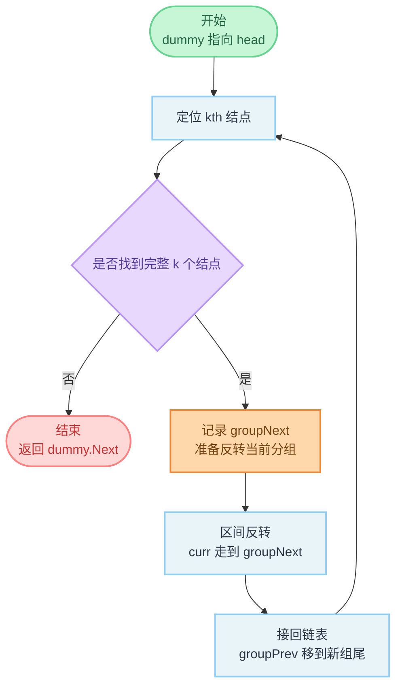

# 25. K 个一组翻转链表

**代码**：[codes/0025-reverse-nodes-in-k-group.go](../codes/0025-reverse-nodes-in-k-group.go)

题库入口：[25. K 个一组翻转链表](https://leetcode.cn/problems/reverse-nodes-in-k-group/?envType=study-plan-v2&envId=top-100-liked)

## 题目

给你链表头结点 `head`，每 `k` 个结点为一组进行翻转，并返回修改后的链表。

- `k` 是正整数，且小于等于链表长度。
- 如果节点总数不是 `k` 的整数倍，那么最后剩余不足 `k` 个节点保持原顺序。
- 只能改变节点的连接关系，不能只改节点值。

**示例**：

- `head = [1,2,3,4,5], k = 2` → `[2,1,4,3,5]`
- `head = [1,2,3,4,5], k = 3` → `[3,2,1,4,5]`

## 思路

### 知识点：哨兵节点 + 链表分段反转

这题本质是「按固定大小切分链表，再对每段做反转」。  
哨兵节点是一个放在头结点前面的辅助节点，它能统一处理「第一组就要翻转」这种头结点会变化的情况，避免写很多分支。  
分段反转沿用链表反转的三指针写法：`curr`、`next`、`prev`，只是反转范围从整条链表变成某一段 `k` 个结点。

### 怎么想到

- **题目在问什么**：每 `k` 个结点翻转，不足 `k` 的尾段不动。  
- **朴素卡在哪**：先把链表拷贝进数组再处理比较直观，但不符合链表原地操作的训练目标。  
- **换什么技巧**：直接在链表上做「分组 + 反转 + 接回」。每轮先判断是否凑够 `k` 个，再决定是否翻转，这样尾段不足 `k` 时天然保留原样。

### 核心步骤

1. 建立哨兵 `dummy`，并让 `groupPrev` 指向当前分组前一个结点。  
2. 从 `groupPrev` 往后找第 `k` 个结点 `kth`：  
   - 找不到，说明剩余不足 `k`，结束。  
   - 找到，记下下一段起点 `groupNext = kth.Next`。  
3. 反转 `groupPrev.Next` 到 `kth` 这一段：  
   - 令 `prev = groupNext`，`curr = groupPrev.Next`。  
   - 循环直到 `curr == groupNext`，逐个改指针方向。  
4. 把反转后的分组接回原链：  
   - 新组头是 `kth`；新组尾是反转前的组头 `groupPrev.Next`。  
   - `groupPrev.Next = 新组头`，再把 `groupPrev` 移到新组尾，进入下一组。  

### 复杂度

- **时间复杂度**：`O(n)`。每个结点最多被访问常数次。  
- **空间复杂度**：`O(1)`。只使用若干指针变量。

### 易错点

1. **先判断是否有 `k` 个结点**，再反转；否则会错误处理尾段。  
2. 反转循环终止条件是 `curr == groupNext`，这是半开区间写法的关键。  
3. 每组翻转后，`groupPrev` 要移动到「新组尾」，否则下一组起点会错。  
4. `k <= 1` 可直接返回原链，避免无意义操作。

## 变种思路

| 题号与题名 | 与本题关系 |
|------------|------------|
| [206. 反转链表](https://leetcode.cn/problems/reverse-linked-list/) | 本题每个分组内部就是 206 的局部反转。 |
| [92. 反转链表 II](https://leetcode.cn/problems/reverse-linked-list-ii/) | 同样是「反转某个区间」，本题是多个固定长度区间重复执行。 |
| [24. 两两交换链表中的节点](https://leetcode.cn/problems/swap-nodes-in-pairs/) | 等价于本题 `k = 2` 的特例。 |

---

## 流程图解

