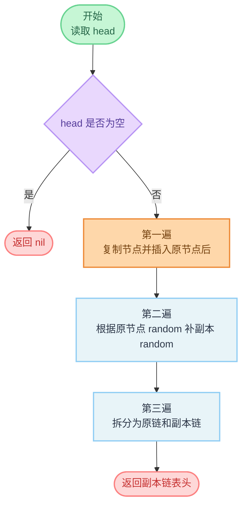

# 138. 随机链表的复制

**代码**：[codes/0138-copy-list-with-random-pointer.go](../codes/0138-copy-list-with-random-pointer.go)

题库入口：[138. 随机链表的复制](https://leetcode.cn/problems/copy-list-with-random-pointer/?envType=study-plan-v2&envId=top-100-liked)

## 题目

给你一个长度为 `n` 的链表，每个节点有两个指针：

- `next`：指向下一个节点；
- `random`：可以指向链表中的任意节点，也可以是 `null`。

请你返回这个链表的**深拷贝**头节点。深拷贝要求：

- 新链表中的节点都必须是新创建的节点；
- 新节点的 `val` 与原节点对应；
- 新节点的 `next`、`random` 关系和原链表完全一致。

**示例**：

- `head = [[7,null],[13,0],[11,4],[10,2],[1,0]]`：返回结构一致但节点地址全新的链表。
- `head = []`：返回 `[]`。

## 思路

### 知识点：穿插复制（Interweaving）

这题难点在 `random`，它不是顺序关系，不能只靠 `next` 一次线性复制。  
穿插复制的做法是把复制节点插在原节点后面，这样每个原节点和它的副本天然相邻。  
借助这个相邻关系，就能在 `O(1)` 额外空间下定位 `random` 的副本节点，不用哈希表。

### 怎么想到

- **题目在问什么**：不仅复制值，还要完整复制 `next` 与 `random` 的连接关系。  
- **朴素卡在哪**：直接新建节点后，难以在不额外存映射的情况下快速找到 `random` 对应副本。  
- **换什么技巧**：先把副本节点“贴”在原节点后面，形成局部映射，再分三遍完成全部链接。

### 核心步骤

1. **第一遍：复制并穿插**  
   对每个原节点 `x` 创建副本 `x'`，并插到 `x` 后面：`x -> x' -> oldNext`。

2. **第二遍：补齐副本 random**  
   若原节点 `x.Random = y`，那么副本应指向 `y'`。由于 `y'` 就在 `y` 后面，所以可写为 `x'.Random = x.Random.Next`。

3. **第三遍：拆分两条链**  
   把交错链表拆开：恢复原链表 `x -> oldNext`，同时串起副本链表 `x' -> oldNext'`。

### 复杂度

- **时间复杂度**：`O(n)`，三遍线性扫描。  
- **空间复杂度**：`O(1)`，不计输出链表本身。

### 补充：哈希表法（更直观）

如果面试官不强调额外空间，哈希表法更容易一次说清楚，模板也稳定。

1. **第一遍**：遍历原链表，为每个旧节点 `x` 创建新节点 `x'`，并记录映射 `mp[x] = x'`。  
2. **第二遍**：再次遍历原链表，用映射补关系：  
   - `mp[x].Next = mp[x.Next]`（若 `x.Next` 为空则为 `nil`）  
   - `mp[x].Random = mp[x.Random]`（若 `x.Random` 为空则为 `nil`）  
3. 返回 `mp[head]`。

该方法复杂度：

- 时间 `O(n)`（两遍扫描）
- 额外空间 `O(n)`（哈希映射）

适用取舍：

- **优点**：思路直接，边界更不容易写错。  
- **缺点**：空间不是最优。  
- **建议**：面试先讲哈希表法拿稳，再补一句“还能优化到 `O(1)` 额外空间（当前正文的穿插复制法）”。

### 易错点

1. 第二遍设置 `random` 时，注意判空：`curr.Random == nil` 时不能取 `Next`。  
2. 第三遍拆分时，要同时维护原链和新链，顺序写反容易断链。  
3. 返回值是新链表头 `head.Next`（第一遍后），不是原头。  
4. 空链表 `head == nil` 要直接返回 `nil`。

## 变种思路

| 题号与题名 | 与本题关系 |
|------------|------------|
| [133. 克隆图](https://leetcode.cn/problems/clone-graph/) | 同为“复制节点 + 复制边关系”，通常用映射完成旧到新的对应。 |
| [138. 随机链表的复制（哈希表法）](https://leetcode.cn/problems/copy-list-with-random-pointer/) | 同题另一主流解法，`map[旧节点]新节点` 两遍完成，空间 `O(n)`。 |
| [146. LRU 缓存](https://leetcode.cn/problems/lru-cache/) | 不是复制题，但同样依赖“节点指针关系正确维护”，训练链表指针操作稳定性。 |

**备注**：若面试官不强调空间，哈希表法更直观；本题这里采用穿插复制，优势是 `O(1)` 额外空间。

---

## 流程图解

