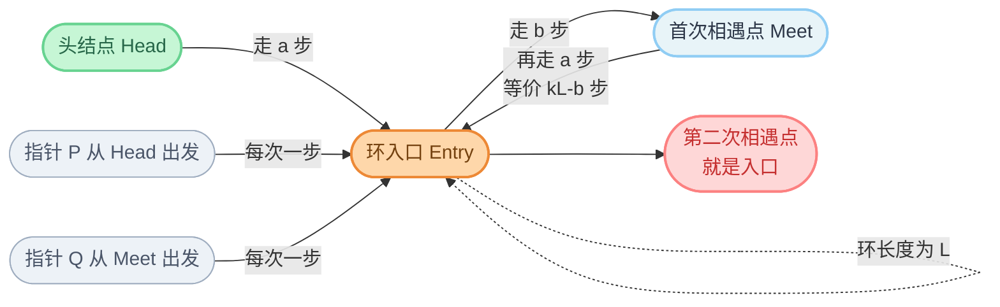

# 142. 环形链表 II

**代码**：[codes/0142-linked-list-cycle-ii.go](../codes/0142-linked-list-cycle-ii.go)

题库入口：[142. 环形链表 II](https://leetcode.cn/problems/linked-list-cycle-ii/?envType=study-plan-v2&envId=top-100-liked)

## 题目

给定一个链表头结点 `head`，若链表中存在环，返回环的**入口结点**；若不存在环，返回 `nil`。

评测系统内部用整数 `pos` 表示尾结点连接到链表中的位置（`pos = -1` 表示无环），该值仅用于构造测试，函数参数里不会直接传入 `pos`。

要求：不允许修改链表结构，尽量使用 `O(1)` 额外空间。

**示例**：

- `head = [3,2,0,-4], pos = 1` → 返回索引为 `1` 的结点（值 `2`）。
- `head = [1], pos = -1` → 返回 `nil`。

## 思路

### 知识点：Floyd 快慢指针（判环 + 定位入口）

快慢指针是链表中处理「是否有环」最经典的常数空间方法：慢指针每次走一步，快指针每次走两步。若有环，二者必在环内某点相遇；若无环，快指针会先到 `nil`。本题比 141 多一步：在首次相遇后，把一个指针放回头结点，然后两个指针都一次走一步，再次相遇点就是入口。

### 怎么想到

- **题目在问什么**：不是只判断有无环，而是要找出环开始的位置。  
- **朴素卡在哪**：哈希记录访问过的结点能做，但空间 `O(n)`；题目希望常数额外空间。  
- **换什么技巧**：先用 141 同款快慢指针确认「有环」，再利用步数关系把入口定位出来，做到 `O(1)` 空间。

### 核心步骤

1. 初始化 `slow = head`、`fast = head`。  
2. 循环 `fast != nil && fast.Next != nil`：`slow` 走一步，`fast` 走两步。  
3. 若循环中 `slow == fast`：说明有环，设 `p = head`。  
4. 让 `p` 与 `slow` 同时每次走一步，直到二者相等；该结点即环入口。  
5. 若循环结束仍未相遇，返回 `nil`（无环）。

### 为什么“第二次相遇”就是入口（推断过程）

设：

- 从头结点到环入口长度为 `a`；
- 从入口到首次相遇点长度为 `b`；
- 环长度为 `L`。

当慢指针首次到达相遇点时，慢指针一共走了 `a + b` 步。快指针每次比慢指针多走一步，因此快指针总步数是 `2(a+b)`。  
两者走过的步数差一定是环长度的整数倍：

`2(a+b) - (a+b) = kL`  ⇒  `a + b = kL`。

于是得到：

`a = kL - b`。

右边含义是：从**相遇点**再往前走 `kL-b` 步，等价于先走到本圈入口（还需 `L-b` 步），再绕若干整圈，最终会落在入口。  
也就是说：从相遇点出发，走 `a` 步会到入口；从头结点出发，走 `a` 步也正好到入口。

所以把一个指针放回头结点，另一个留在首次相遇点，两者同速一步一步走，必然在入口再次相遇。

### 复杂度

- **时间**：`O(n)`。快慢指针判环 + 定位入口都在线性步数内完成。  
- **空间**：`O(1)`。仅使用固定数量指针。

### 易错点

1. 与 141 的区别：141 相遇就能返回 `true`；142 必须继续第二阶段找入口。  
2. 循环条件必须是 `fast != nil && fast.Next != nil`，防止空指针。  
3. 返回的是**结点指针**（入口结点），不是入口下标。  
4. `head == nil` 或单节点无环要尽早返回 `nil`。

## 变种思路

| 题号与题名 | 与本题关系 |
|------------|------------|
| [141. 环形链表](https://leetcode.cn/problems/linked-list-cycle/) | 同一快慢指针判环第一阶段；本题在此基础上继续找入口。 |
| [876. 链表的中间结点](https://leetcode.cn/problems/middle-of-the-linked-list/) | 同属快慢指针，但目标从「判环」变为「找中点」。 |
| [160. 相交链表](https://leetcode.cn/problems/intersection-of-two-linked-lists/) | 也是双指针步数对齐思想，目标是找相交起点。 |

**备注**：也可用哈希表记录访问过的结点，首次重复访问即入口，代码直观但空间是 `O(n)`；面试更推荐本题的 Floyd 常数空间解法。

---

## 流程图解

