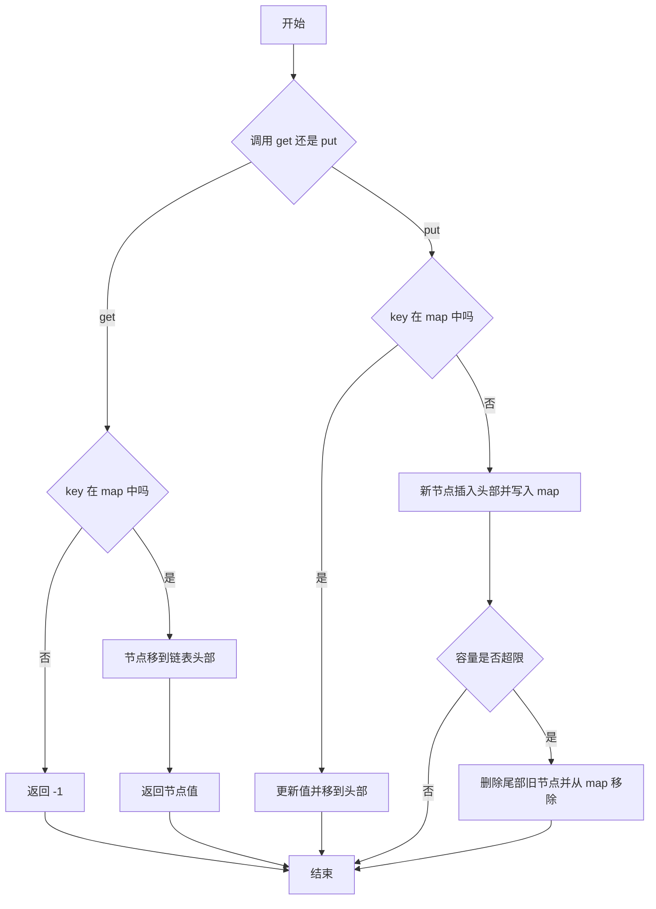

# 146. LRU 缓存

**代码**：[codes/0146-lru-cache.go](../codes/0146-lru-cache.go)

题库入口：[146. LRU 缓存](https://leetcode.cn/problems/lru-cache/?envType=study-plan-v2&envId=top-100-liked)

## 题目

请你设计并实现一个满足 `LRU (Least Recently Used)` 约束的数据结构，支持：

- `LRUCache(int capacity)`：用正整数容量初始化缓存。
- `int get(int key)`：若 key 存在，返回其值，否则返回 `-1`。
- `void put(int key, int value)`：插入或更新 key。若超出容量，淘汰最近最少使用的 key。

要求：`get` 与 `put` 的平均时间复杂度都是 `O(1)`。

**示例**：

- `LRUCache lRUCache = new LRUCache(2)`
- `lRUCache.put(1, 1)`
- `lRUCache.put(2, 2)`
- `lRUCache.get(1)` 返回 `1`
- `lRUCache.put(3, 3)` 会淘汰 key `2`
- `lRUCache.get(2)` 返回 `-1`

## 思路

### 知识点：哈希表 + 双向链表

哈希表擅长按 key `O(1)` 找到节点，但不会维护“最近使用顺序”。  
双向链表擅长 `O(1)` 插入/删除任意已知节点，适合维护“新旧顺序”。  
二者结合后：哈希表负责定位，双向链表负责排序；链表头放“最新使用”，链表尾放“最久未使用”。

### 怎么想到

- **题目在问什么**：既要按 key 快速读写，又要按访问时间快速淘汰旧数据。  
- **朴素卡在哪**：只用数组/单链表能维护顺序，但按 key 查找会退化到 `O(n)`。只用哈希表能查找快，但无法快速找到“最旧”节点。  
- **换什么技巧**：把“查找”和“顺序维护”拆给两个结构：`map + doubly linked list`，让两个操作都维持 `O(1)`。

### 核心步骤

1. 维护一个 `map[key]*node`，可以 `O(1)` 找到节点。  
2. 维护带伪头尾的双向链表：
   - 头部后面是最近使用节点；
   - 尾部前面是最久未使用节点。  
3. `get(key)`：
   - 不存在返回 `-1`；
   - 存在则把节点移到头部，再返回值。  
4. `put(key, value)`：
   - 已存在：更新值并移到头部；
   - 不存在：新建节点插到头部；
   - 若超容量：删除尾部前节点，并同步从 `map` 删除。

### 复杂度

- **时间复杂度**：`get` / `put` 均为 `O(1)`（平均）。  
- **空间复杂度**：`O(capacity)`。

### 易错点

1. 更新已存在 key 时，也要移动到头部。  
2. 淘汰时必须同时更新链表和哈希表，二者保持一致。  
3. 双向链表建议使用伪头尾节点，减少空链和单节点分支判断。  
4. `removeNode` 前要保证节点已在链中，避免空指针。

### 面试口述模板（60 秒）

我会用 `哈希表 + 双向链表` 实现 LRU。  
哈希表负责 `O(1)` 定位 key 对应节点；双向链表维护访问新旧顺序，头部是最近使用，尾部是最久未使用。  
`get` 时如果 key 不存在返回 `-1`，存在就把该节点移动到头部再返回值。  
`put` 时如果 key 已存在就更新并移动到头部；不存在就新建节点放到头部。  
如果插入后超过容量，就删除尾部前一个节点，并从哈希表里同步删除这个 key。  
这样 `get/put` 平均都是 `O(1)`，空间是 `O(capacity)`。

## 变种思路

| 题号与题名 | 与本题关系 |
|------------|------------|
| [460. LFU 缓存](https://leetcode.cn/problems/lfu-cache/) | 同为缓存淘汰策略设计，LFU 维护“最少使用频次”更复杂。 |
| [432. 全 O(1) 的数据结构](https://leetcode.cn/problems/all-oone-data-structure/) | 同样追求操作均摊 `O(1)`，也大量使用双向链表 + 哈希。 |
| [380. O(1) 时间插入、删除和获取随机元素](https://leetcode.cn/problems/insert-delete-getrandom-o1/) | 同为“多操作都要 O(1)”的结构设计题。 |

**备注**：本题也可借助语言内置有序字典实现，但面试通常更看重手写 `map + 双向链表` 的通用模板。

---

## 流程图解

