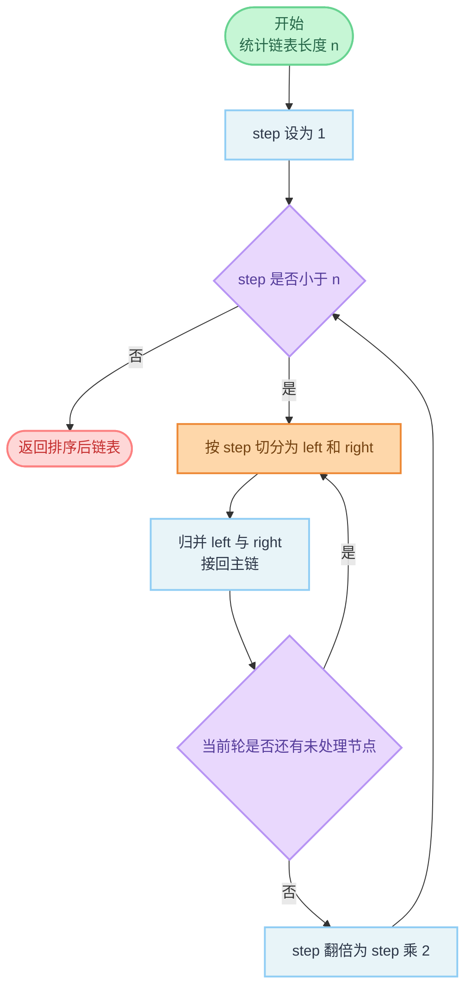

# 148. 排序链表

**代码**：[codes/0148-sort-list.go](../codes/0148-sort-list.go)

题库入口：[148. 排序链表](https://leetcode.cn/problems/sort-list/?envType=study-plan-v2&envId=top-100-liked)

## 题目

给你链表头结点 `head`，请将其按升序排序并返回排序后的链表。

要求尽量在 `O(n log n)` 时间复杂度内完成，进阶目标是 `O(1)` 额外空间（不计递归栈时通常指迭代写法）。

**示例**：

- `head = [4,2,1,3]` → `[1,2,3,4]`
- `head = [-1,5,3,4,0]` → `[-1,0,3,4,5]`

## 思路

### 知识点：链表归并排序（自底向上）

链表不支持随机访问，所以不适合像数组那样用快速排序或堆排序模板。  
归并排序非常适合链表：拆分和拼接都只改指针，不需要搬移元素。  
本题选 **自底向上归并**，按段长 `1,2,4,8...` 逐轮合并，满足 `O(n log n)` 时间且额外空间 `O(1)`。

### 怎么想到

- **题目在问什么**：给单链表排序，并希望时间优于 `O(n^2)`。  
- **朴素卡在哪**：冒泡/选择/插入排序在链表上都可能退化到平方复杂度。  
- **换什么技巧**：用归并排序。若写递归版会有 `O(log n)` 递归栈；题目进阶偏向常数额外空间，所以采用迭代版（自底向上）。

### 核心步骤

1. 先遍历一次得到链表长度 `n`。  
2. 令分段长度 `step = 1`，每轮把链表按 `step` 切成很多对：`left` 和 `right`。  
3. 对每一对执行有序归并，并把归并结果接回主链。  
4. 一轮结束后 `step *= 2`，继续下一轮，直到 `step >= n`。  

关键子过程：

- `split(head, step)`：从 `head` 开始切出长度为 `step` 的一段，并返回后半段头节点。  
- `mergeTwoSortedLists(l1, l2)`：合并两个有序链表，返回「合并后头节点 + 尾节点」，便于接回主链。

### 复杂度

- **时间复杂度**：`O(n log n)`。每一轮归并总处理 `n` 个节点，共 `log n` 轮。  
- **空间复杂度**：`O(1)`。只使用若干指针变量（不使用递归栈）。

### 易错点

1. `split` 需要在切点处断开 `Next`，否则会形成错误连接或死链。  
2. 每次归并后要拿到**尾节点**，下一段才能正确接到尾后面。  
3. 内层循环中 `right` 可能为 `nil`（剩余不足一段），归并函数要能处理空链。  
4. 外层 `step` 必须按 `1,2,4...` 翻倍，不能线性加一。

## 变种思路

| 题号与题名 | 与本题关系 |
|------------|------------|
| [21. 合并两个有序链表](https://leetcode.cn/problems/merge-two-sorted-lists/) | 本题归并步骤的基础子问题。 |
| [23. 合并 K 个升序链表](https://leetcode.cn/problems/merge-k-sorted-lists/) | 同样是多路归并思想，常用分治/堆优化。 |
| [147. 对链表进行插入排序](https://leetcode.cn/problems/insertion-sort-list/) | 同为链表排序，但时间复杂度通常为 `O(n^2)`。 |

**备注**：递归归并排序代码更短更直观，但会产生 `O(log n)` 递归栈；本题代码选择迭代版以贴近进阶要求。

---

## 流程图解

